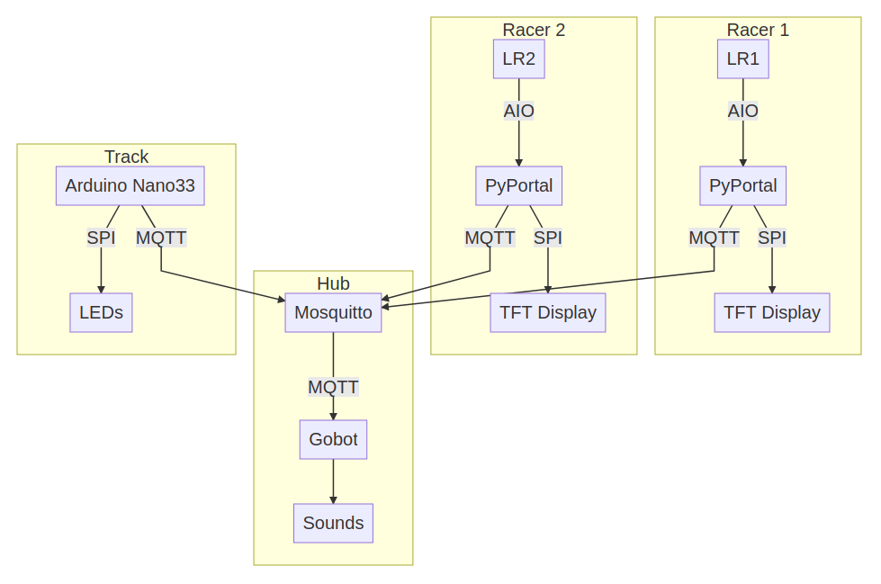

# TinyGoLEDRace

This is basically a version of https://openledrace.net/ written in Go using TinyGo, Gobot, with an MQTT server.

The racer controllers will be foam mats that have a force sensitive resistor inside them. Each player will run or jump in place on top of their mat to make their racer move.

## How it works

## Hardware

### Hub

Raspberry Pi 3 Model 1, with WiFi/Bluetooth
Some kind of speakers
Hub runs the MQTT server, and also the Gobot program with the game sounds/logic.

### Racer

PyPortal
1 connected force sensitive resistors (FSR).
Display

### Track

Arduino Nano33 IoT
Strip of APA102 lights
Button to start the game?

## MQTT protocol

### Hub

`tinygorace/hub/available`

Published by the hub when it is available for a race

`tinygorace/race/starting`

Published by the hub when there is a race getting ready to start. 
Racers should join the race by publishing `tinygorace/racer/{racerid}/join` message.

`tinygorace/race/countdown`

data: {count}
published by the hub when there is a race counting down to start

`tinygorace/race/start`

published by the hub when the race starts

`tinygorace/race/over`

published by the hub when the race ends

`tinygorace/race/winner`

published by hub when the race ends to signify the race winner

`tinygorace/racer/{racerid}/joined`

Published by the hub for each racer when it has successfully joined a race

`tinygorace/racer/{racerid}/position`

published by hub to signify the position of a racer on the track

### Racer

`tinygorace/racer/{racerid}/available`

published by the racer when it is available to race

`tinygorace/racer/{racerid}/join`

published by the racer when it is ready to join a race

`tinygorace/racer/{racerid}/ready`

published by the racer when it is ready to race

`tinygorace/racer/{racerid}/racing`

data: {about the racer's movement}
published by the racer when it is racing in a race

### Track

`tinygorace/track/{trackid}/ready`

published by the track when it is ready for a race

